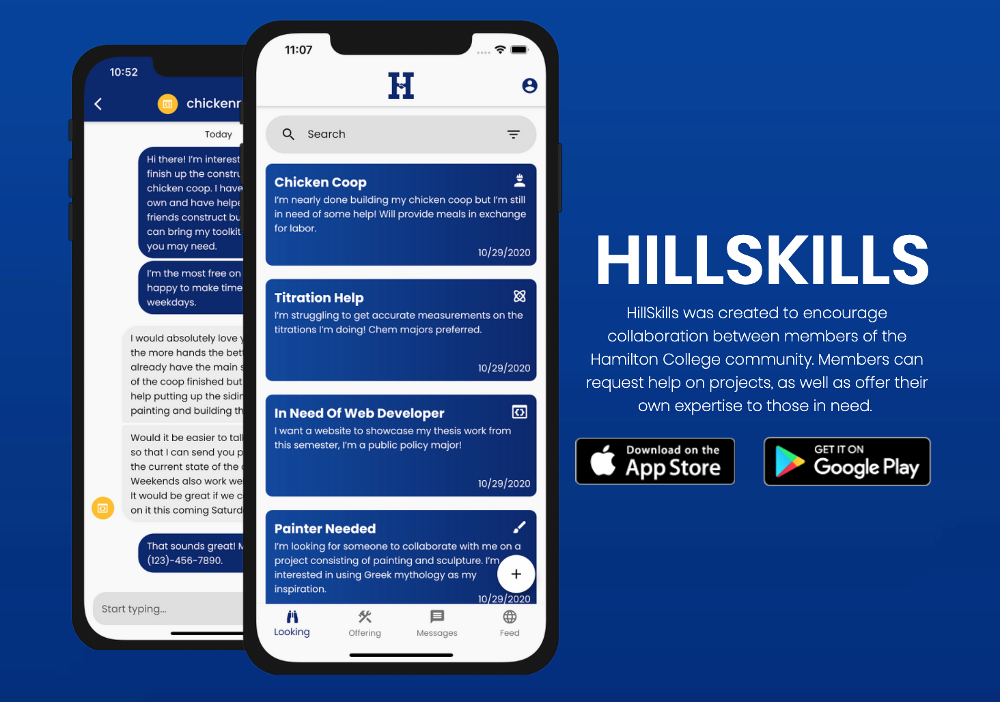
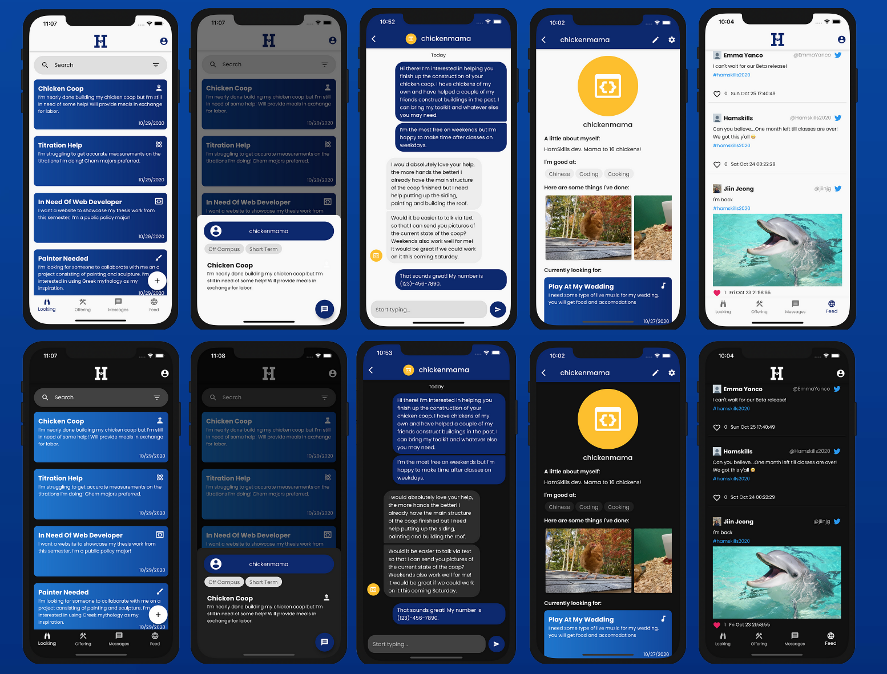

# hillskills
* **Description**: Cross-platform (iOS and Android) mobile application using Flutter/Dart (frontend) and Firebase (backend). It is a social-media mobile application for collaborative projects on Hamilton's campus. This repository only contains the **lib** code. HillSkills is currently available on [Apple App Store](https://apps.apple.com/us/app/hillskills/id1540851136) and [Google Play Store](https://play.google.com/store/apps/details?id=edu.HamiltonCS.HillSkills). Only users with a Hamilton email will be able to sign up for an account.
* **Date**: Aug - Dec 2020
* **Teammates**: Emma Yanco, Seamus Wiseman, Kirubel Tesfaye
* **Special Thanks**: Professor Strash (Hamilton, CS) who served as our technical supervisor and Professor Huff (Hamilton, Digital Arts) who served as our client.

## App summary

## App screens in light and dark mode
Screens include registration sequence, log-in, looking/offering post feed, private messaging feature, social feed, profile and profile edit, app info, and settings.   

